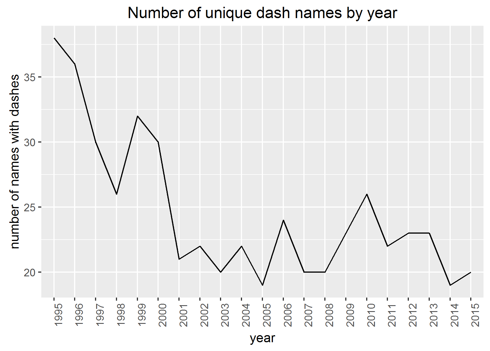
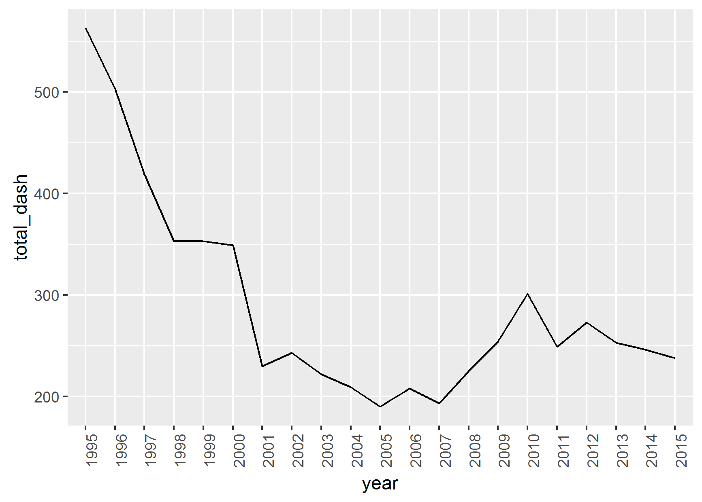
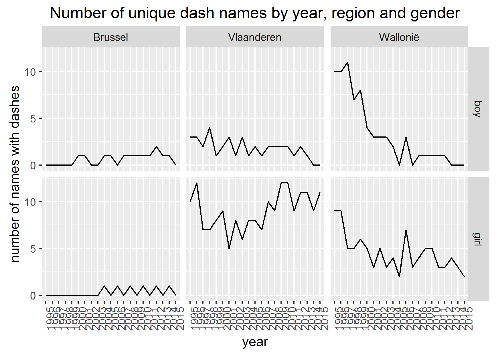

# Dash names

## Introduction

Recently it seems dash names (e.g. Marie-Jeanne or Jean-Pierre) have become a lot more popular. I'd like to find out 2 things:

* is this really the case?
* if so, do the individual parts of the name say something about the dash name?

## Popularity dash names

We can try to measure popularity by calculating the number of unique dash names by year.

My initial assumption of the rise of dash names seems off at first. A possible explanation could be less dash names are used more frequently. The following graph takes counts of occurences of each name into account to calculate a total.

The *total method* seems to lead to the same conclusions as the *unique method* used above. Dash names really seem to become less popular.

We also have information on the region and gender, might be interesting looking at the influence of each of these.

Some interesting patterns pop up:

* Brussels has no tradition of dash names
* In general dash names have been steadily becoming more unpopular
* The only category bucking this trend are Flemish girls
* The sharpest decrease can be noticed for Walloon boys

It's a bit odd we're doing an analysis about names but haven't talked about any specific names yet. Let's change this by looking at the relationship between a dash name and its constituent parts.

