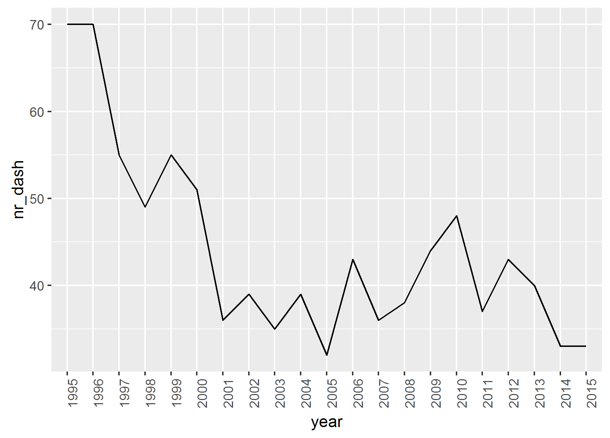

# Dash names

## Introduction

Recently it seems dash names (e.g. Marie-Jeanne or Jean-Pierre) have become a lot more popular. I'd like to find out 2 things:

* is this really the case?
* if so, do the individual parts of the name say something about the dash name?

## Popularity dash names

Obviously my initial assumption of the rise of dash names was off big time.